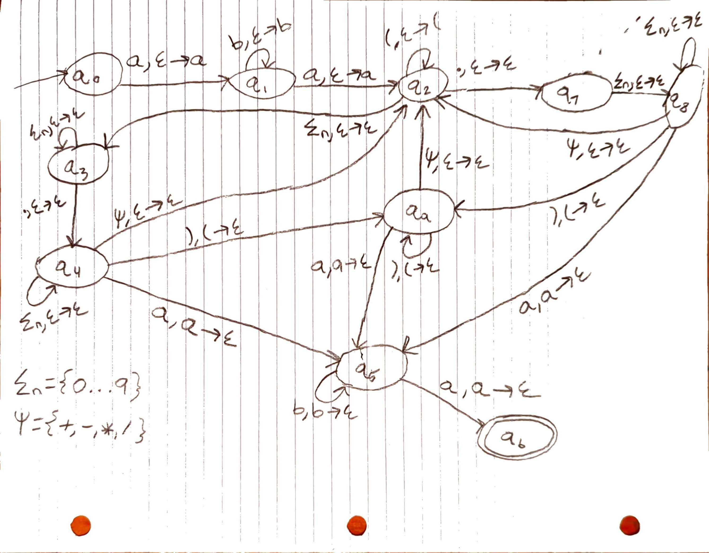

# Overview
This project demonstrates a context-free language (CFL), *A*, which consists of valid arithmetic operations on floating-point numbers. The included C program, `pda.c`, takes as input a plaintext file of strings and runs them through a push-down automaton (PDA) to determine whether each string exists in *A*.

# The Language *A*
This language has a context-free grammar (CFG), which is defined as a 4-tuple, *G* = (*V*, $\Sigma$, *R*, *S*),
where *V* is the set of variables:  
*V* = {*S*, *T*, *C*, *H*, *Y*, *N*}.  

The alphabet of *A* is $\Sigma$ = {., 0, 1, 2, ... 9, +, -, *, /, (, ), a, b}.  

The rules for the CFG, including the starting variable *S* are as follows:  
*S* $\rightarrow$ a*T*a  
*T* $\rightarrow$ b*T*b | a*C*a  
*C* $\rightarrow$ *C*+*C* | *C*-*C* | *C* / *C* | (*C*) | H  
*H* $\rightarrow$ *Y*.*Y* | *Y*. | .*Y*  
*Y* $\rightarrow$ *NY* | *N*  
*N* $\rightarrow$ 0 | 1 | 2 | ... | 9 

# Diagram of The PDA for *A*
